<div align="center">

# 🏥 Pharmacy AI Agent

[](https://www.python.org/)
[](https://fastapi.tiangolo.com/)
[](https://openai.com/)
[](https://www.docker.com/)

---

</div>

## 🎯 Overview

**Pharmacy AI Agent** is a stateless AI assistant designed for pharmacy operations, providing medication information, checking inventory, and verifying prescriptions in real-time. It features direct OpenAI API integration and supports both Hebrew and English.

**Key Features:**
- Real-time streaming responses via Server-Sent Events (SSE)
- Strict policy enforcement (no medical advice or diagnosis)
- Stateless architecture (no session management)
- Bilingual support (Hebrew/English)

## 📚 Documentation

| Document | Description |
|----------|-------------|
| [FLOWS.md](docs/FLOWS.md) | Complete conversation flows |
| [TOOLS.md](docs/TOOLS.md) | Tool specifications and JSON schemas |
| [EVALUATION_PLAN.md](tests/EVALUATION_PLAN.md) | Testing methodology and results |

---

## 🚀 Installation

### Prerequisites
- Python 3.11+
- OpenAI API Key (GPT-5 access)

### Setup Instructions
**1. Clone & Navigate**
```bash
git clone <repository-url>
cd pharmacy-ai-agent
```
**2. Create and Activate Virtual Environment**
```bash
python -m venv venv
# Windows
venv\Scripts\activate
# macOS/Linux
source venv/bin/activate
```
**3. Install Dependencies**
```bash
pip install -r requirements.txt
```
**4. Configure Environment**
Create `.env` file:
```env
OPENAI_API_KEY=sk-your-actual-api-key-here
OPENAI_MODEL=gpt-5
```
**5. Run Server**
```bash
uvicorn backend.main:app --reload --port 8000
```
**6. Access Application**
Open browser: `http://localhost:8000`

---

## 🐳 Docker Deployment

### Build and Run
```bashi
# Build image
docker build -t pharmacy-ai-agent .
# Run container
docker run -p 8000:8000 -e OPENAI_API_KEY=sk-your-key-here pharmacy-ai-agent
```

---

## 🏗️ Architecture

```mermaid
graph TB
    User[👤 User] -->|HTTP| Frontend[🖥️ Frontend]
    Frontend -->|SSE| FastAPI[⚡ FastAPI]
    FastAPI -->|Pre-check| Policy[🛡️ policy.py]
    Policy -->|✅| Agent[🤖 agent.py]
    Agent -->|Stream| OpenAI[🧠 GPT-5]
    OpenAI -->|Function Call| Tools[🔧 tools.py]
    Tools -->|Query| Data[💾 synthetic_data.py]
    Data --> Tools --> Agent
    Agent -->|SSE| FastAPI --> Frontend
```



---

## 📁 Project Structure

```
pharmacy-agent/
├── backend/
│   ├── agent.py               # Agent orchestration
│   ├── tools.py               # Tool definitions
│   ├── policy.py              # Policy enforcement
│   ├── synthetic_data.py      # Mock database
│   └── main.py                # FastAPI server
├── frontend/
│   └── index.html             # Chat UI
├── docs/
│   ├── FLOWS.md               # Multi-step workflows
│   ├── TOOLS.md               # Tool specifications
│   └── screenshots/           # UI screenshots
├── tests/
│   ├── test_flows.py          # E2E flow tests
│   └── EVALUATION_PLAN.md          # Test plan & results
├── requirements.txt           # Python dependencies
├── Dockerfile                 # Container config
└── README.md                  # This file
```

---

## 🎬 Screenshots

### Chat Interface

*Main interface supporting Hebrew and English*

### Prescription Verification

*Checking prescription validity with ID number*

### Policy Enforcement

*Agent refusing to provide medical advice*

---

## 🧪 Testing

Tests complete user journeys with real OpenAI API calls.
Covers 3 main flows: Basic Inquiries, Prescription Verification, and Policy Enforcement.
Run end-to-end flow tests:
```bash
pytest tests/test_flows.py -v -s
```
See [EVALUATION_PLAN.md](tests/EVALUATION_PLAN.md) for detailed test methodology.

<div align="center">

[⬆ Back to Top](#-pharmacy-ai-agent)

</div>
```
